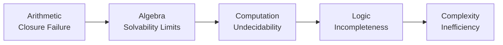

# Limits of Mathematics 🚀

[Overview](#introduction) • [Visual](#visual-journey) • [Synthesis](#final-synthesis) • [Conclusion](#conclusion)

> A conceptual journey from arithmetic to Gödel and P vs NP — exploring what can and **cannot** be solved.

---

## Introduction

This project explores a fundamental idea:

> Mathematics evolves by addressing its own limitations.

Starting from basic arithmetic, we follow a journey through number systems, algebra, computation, and logic — ultimately revealing that **limits are not failures, but intrinsic features of structure**.

> This is not just a journey of solving problems —
> it is a journey of discovering limits.

---

## Why This Matters

* **Cryptography** → relies on problems that are hard (NP-like)
* **AI & Planning** → many tasks are computationally expensive
* **Formal Verification** → Gödel & Halting limits matter in proving correctness
* **Algorithms** → not all solvable problems are efficient (P vs NP)

> Possibility ≠ Practicality.

---

## 1. Arithmetic Foundations

* Multiplication = repeated addition
* Division = inverse of multiplication

Limitations:

* Works cleanly only for natural numbers
* Division not always possible in integers

---

## 2. Extension of Number Systems

* ℕ → ℤ (negatives)
* ℤ → ℚ (fractions)
* ℚ → ℝ (limits & completeness)
* ℝ → ℂ (√−1)

Each extension restores closure — but introduces trade-offs.

---

## 3. Algebraic Structures

* **Group** → captures invertibility
* **Field** → supports +, ×, ÷

Examples:

* ℤ (group under +)
* ℚ, ℝ, ℂ (fields)

---

## 4. Galois Theory – Limits of Solvability

Question:

> Can every polynomial be solved using radicals?

* Quadratic, cubic, quartic → solvable
* Quintic → not solvable in general

Example:

```
x^5 - x + 1 = 0
```

Reason:

* Symmetry group = S₅
* S₅ is not solvable

👉 Insight:

> The limitation lies in structure, not numbers.

---

## 5. Computation – Halting Problem

Question:

> Can we determine whether any program halts?

Answer:

> No universal algorithm exists.

👉 Insight:

> Existence ≠ computability

---

## 6. Gödel’s Incompleteness

> Some true statements cannot be proven.

* If provable → contradiction
* If not provable → true but unprovable

👉 Insight:

> Truth exceeds formal systems

---

## 7. Complexity Theory – P vs NP

```
P ?= NP
```

* P → efficiently solvable
* NP → efficiently verifiable

👉 Insight:

> Possibility ≠ efficiency

---

## Visual Journey



---

## Final Synthesis

| Domain      | Limitation         |
| ----------- | ------------------ |
| Arithmetic  | Closure failure    |
| Algebra     | Solvability limits |
| Computation | Undecidability     |
| Logic       | Incompleteness     |
| Complexity  | Inefficiency       |

---

## Core Insight

> Limits are not flaws in mathematics —
> they are fundamental properties of structure.

---

## Conclusion

* We extend systems to solve problems
* Extensions introduce trade-offs
* Eventually, we encounter inherent limits

Mathematics does not just solve problems —
it reveals what **cannot** be solved.

---

## Final Thought

> Mathematics does not just expand what we can do —
> it reveals what we can never do.

---

**Author:** Sadasivam
**Project:** math-limits-journey
  
